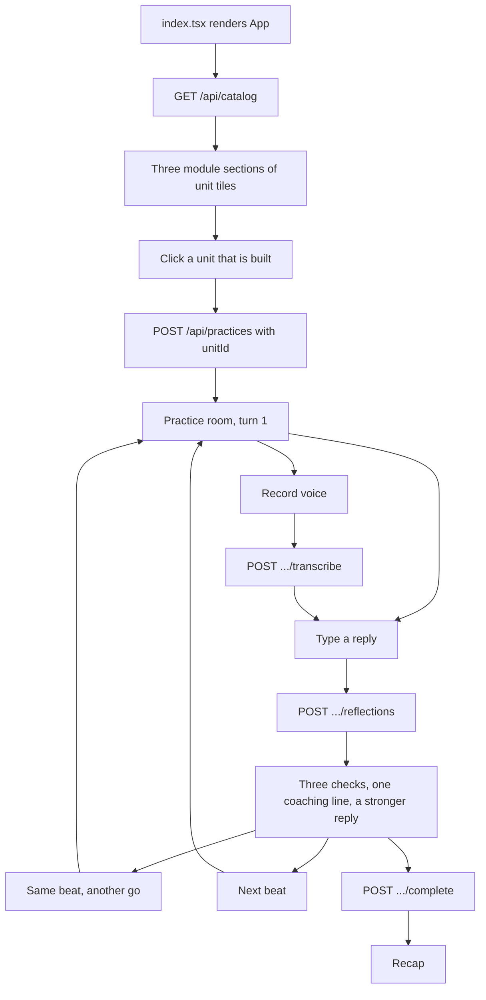

# Kora frontend

This is Kora's React web app: a training ground for learning to talk to people. Three modules — Skills, Emotions, Heart — each holding units. A learner picks a unit, watches someone say something real, replies by voice or text, and finds out exactly what they caught and what they missed.

## Run it

Install packages once:

```bash
npm install
```

Start the development server:

```bash
npm start
```

Open `http://localhost:3000`. The app expects the Ktor backend to be running at `http://localhost:8080`.

Useful checks:

```bash
npm test -- --watchAll=false
npm run build
```

To point the web app at a deployed backend instead of your local one:

```bash
REACT_APP_API_BASE_URL="https://your-api.example.com/api" npm start
```

## Where the frontend starts

The browser starts at [index.tsx](src/index.tsx). It finds the `root` element in `public/index.html`
and renders `<App />` inside a `<BrowserRouter>`. The router lives there rather than inside `App` so
tests can mount `App` under a `MemoryRouter` and drive navigation without touching the address bar.

[App.tsx](src/App.tsx) is a shell: the chrome, the routes, and the error banner. The state lives in
two hooks it calls — `useCatalog` for what the home page lists, `usePractice` for the one conversation
in flight — and the screens read them.

## Brand and theming

Kora wears the Onion Loop brand. The whole palette lives as CSS custom properties in
[index.css](src/index.css) — one `:root` block for light, one `[data-theme="dark"]` block for dark —
and **no rule in [App.css](src/App.css) names a colour directly**. That is what lets the app switch
theme by setting one attribute on `<html>`, with no component re-rendering.

If you add a colour, add a token. A hex baked into a rule is a light-mode colour that survives the
theme switch and breaks dark mode.

A few wash values (`--success-bg`, `--warn-bg`, and `--tint` in dark) look like odd numbers because
they are: at rounder values the text on them lands just under WCAG AA 4.5:1. Check contrast before
rounding them off.

| Piece | Where |
| --- | --- |
| Tokens, light and dark | [src/index.css](src/index.css) |
| Component styling | [src/App.css](src/App.css) |
| Header, footer | [src/components/SiteHeader.tsx](src/components/SiteHeader.tsx), [SiteFooter.tsx](src/components/SiteFooter.tsx) |
| Theme state | [src/hooks/useTheme.ts](src/hooks/useTheme.ts) |
| Pre-paint theme (stops the dark-mode flash) | inline script in [public/index.html](public/index.html) |
| Logo, onion pattern | `public/brand/`, `src/assets/onion-pattern.svg` |

The preference is stored under the `theme` key in `localStorage` — the same key the marketing site
at onionloop.com uses, so a visitor's choice carries across both.

> The onion pattern is imported from `src/assets/`, not `public/`. A root-absolute `url('/…')` in a
> CRA stylesheet fails to resolve at build time; importing it from `src/` also gets it fingerprinted.

## Routes

| Route | Screen |
| --- | --- |
| `/` | The training ground: three module sections of unit tiles |
| `/units/:unitId` | The practice room |
| `/units/:unitId/recap` | The recap |
| `/modules/:moduleId` | Redirects to `/units/:moduleId` — bookmarks from before units had their own name |

There is no page between the grid and the practice room. Clicking a tile creates the practice and
then navigates, in that order, so a failure leaves the learner on the home page beside the tile they
clicked rather than on a practice screen that would have to explain itself. The same `start()` runs
from the other direction when `/units/:unitId` is pasted into a fresh tab.

A unit that is in the catalogue but has no exercises yet is answered from the catalogue — that URL
says "isn't built yet" without asking the server, because the server would give the same answer one
round trip later.

`/units/:unitId/recap` redirects to `/` when there is nothing in flight: a practice lives in memory
only, so there is no conversation to resume after a reload.

Client-side routing needs the host to serve `index.html` for every path. `public/_redirects` covers
Netlify; on GitHub Pages, copy `index.html` to `404.html` after building.

## How data moves through the web app



Every request goes through `request<T>()` in [src/api.ts](src/api.ts). It sets JSON headers for
normal requests, leaves `FormData` untouched for audio uploads, and gives everything a timeout —
10s, or 45s for the two calls that wait on a model.

## Where the pieces live

| Piece | Where |
| --- | --- |
| Shell, routes, error banner | [src/App.tsx](src/App.tsx) |
| The curriculum, as fetched | [src/hooks/useCatalog.ts](src/hooks/useCatalog.ts) |
| One practice, start to recap | [src/hooks/usePractice.ts](src/hooks/usePractice.ts) |
| Microphone and transcription | [src/hooks/useVoiceInput.ts](src/hooks/useVoiceInput.ts) |
| Screens | [src/screens/](src/screens) |
| Everything a screen is made of | [src/components/](src/components) |
| HTTP, and the two failure types | [src/api.ts](src/api.ts) |
| What a failure means, and its words | [src/errors.ts](src/errors.ts) |
| Wire types mirroring the Kotlin | [src/types.ts](src/types.ts) |

`usePractice` is called once, in `App`, and handed to the screens that need it. A practice outlives
the screen that started it — the recap is a different route reading the same conversation — and two
consumers is not enough to justify a context.

## Errors

There is no generic "something went wrong" any more. Every failure leaves `api.ts` as one of two
types (`NetworkError`, `ApiError`), `toAppError` in [src/errors.ts](src/errors.ts) turns it into an
`AppError` with a `kind`, and the `kind` decides where it is shown:

| Where | Which failures | Why there |
| --- | --- | --- |
| Banner, above the page | offline, timeout, 5xx | The page still works. Dismissible, and cleared on navigation, so an error raised on one screen cannot follow you to the next. Carries **Try again**, because the same request could work twice. |
| Inline, by the control | a 4xx with a message, no microphone, microphone refused | Fixing the input *is* the retry. The server's own words are used verbatim — it knows what was wrong with the request and we do not. |
| Page, replacing the content | unknown unit (404), unit not built yet (409), practice finished (409), catalogue failed to load | There is nothing else on the page worth showing. |

Two things are deliberately silent: a clip that will not load (the transcript takes over and the
exercise carries on — an alert about a handled failure is noise), and the server's own message on a
5xx (it can be a stack detail; the fixed copy is what a person reads).

## Adding a unit

Nothing here. The catalogue is served by the backend, including the units nobody has written yet —
the browser holds no list of titles to keep in step. Add it to
`backend/src/main/kotlin/com/buddygo/gym/Catalog.kt`.
