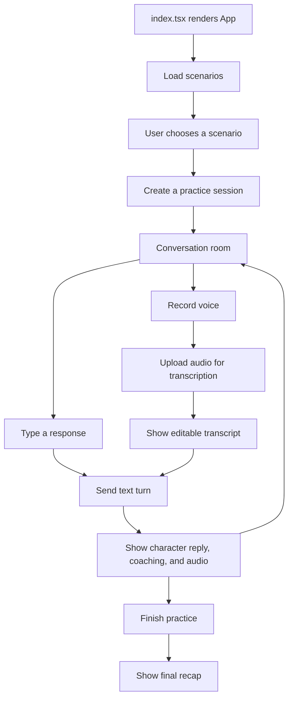

# Kora frontend

This is Kora's React web app. It lets someone choose a small-talk scenario, speak or type a response, hear the character reply, and receive short coaching after every turn.

## Run it

Install packages once:

```bash
npm install
```

Start the development server:

```bash
npm start
```

Open `http://localhost:3000`. The app expects the Ktor backend to be running at `http://localhost:8080`.

Useful checks:

```bash
npm test -- --watchAll=false
npm run build
```

To point the web app at a deployed backend instead of your local one:

```bash
REACT_APP_API_BASE_URL="https://your-api.example.com/api" npm start
```

## Where the frontend starts

The browser starts at [index.tsx](src/index.tsx). It finds the `root` element in `public/index.html`
and renders `<App />` inside a `<BrowserRouter>`. The router lives there rather than inside `App` so
tests can mount `App` under a `MemoryRouter` and drive navigation without touching the address bar.

[App.tsx](src/App.tsx) holds app-wide state — the chosen module, the practice in flight, the
transcript, microphone recording and transcription upload — and renders the four screens as routes.

## Brand and theming

Kora wears the Onion Loop brand. The whole palette lives as CSS custom properties in
[index.css](src/index.css) — one `:root` block for light, one `[data-theme="dark"]` block for dark —
and **no rule in [App.css](src/App.css) names a colour directly**. That is what lets the app switch
theme by setting one attribute on `<html>`, with no component re-rendering.

If you add a colour, add a token. A hex baked into a rule is a light-mode colour that survives the
theme switch and breaks dark mode.

A few wash values (`--success-bg`, `--warn-bg`, and `--tint` in dark) look like odd numbers because
they are: at rounder values the text on them lands just under WCAG AA 4.5:1. Check contrast before
rounding them off.

| Piece | Where |
| --- | --- |
| Tokens, light and dark | [src/index.css](src/index.css) |
| Component styling | [src/App.css](src/App.css) |
| Header, footer | [src/components/SiteHeader.tsx](src/components/SiteHeader.tsx), [SiteFooter.tsx](src/components/SiteFooter.tsx) |
| Theme state | [src/hooks/useTheme.ts](src/hooks/useTheme.ts) |
| Pre-paint theme (stops the dark-mode flash) | inline script in [public/index.html](public/index.html) |
| Logo, onion pattern | `public/brand/`, `src/assets/onion-pattern.svg` |

The preference is stored under the `theme` key in `localStorage` — the same key the marketing site
at onionloop.com uses, so a visitor's choice carries across both.

> The onion pattern is imported from `src/assets/`, not `public/`. A root-absolute `url('/…')` in a
> CRA stylesheet fails to resolve at build time; importing it from `src/` also gets it fingerprinted.

## Routes

| Route | Screen |
| --- | --- |
| `/` | The module list |
| `/modules/:moduleId` | Module intro — fetches from the URL param, so it deep-links |
| `/practice` | The practice room |
| `/recap` | The recap |

`/practice` and `/recap` redirect to `/` when there is nothing in flight: a practice lives in memory
only, so there is no conversation to resume after a reload.

Client-side routing needs the host to serve `index.html` for every path. `public/_redirects` covers
Netlify; on GitHub Pages, copy `index.html` to `404.html` after building.

## How data moves through the web app



The API base URL is set near the top of `App.tsx`:

```ts
const API_BASE_URL = process.env.REACT_APP_API_BASE_URL || 'http://localhost:8080/api';
```

The `request<T>()` helper below it makes every backend request. It adds JSON headers for normal requests and leaves `FormData` untouched for audio uploads.

## Screen flow

### 1. Scenario picker

When `App` first renders, a `useEffect` calls:

```text
GET /api/scenarios
```

The returned scenarios become the three cards shown on the landing page. Clicking a card stores the chosen `Scenario` in React state and moves to the opening-choice screen.

### 2. Who starts?

The user selects either:

- `CHARACTER_GREETS` — Kora asks the backend for the character's greeting.
- `USER_STARTS` — the conversation room begins with an empty chat and an opening suggestion.

Clicking **Begin practice** creates a session first:

```text
POST /api/sessions
```

Then, only when the character starts:

```text
POST /api/sessions/{id}/opening
```

The returned `Session` object holds the id, selected scenario, opening mode, and existing messages.

### 3. Practising a turn

There are two ways to make a response:

| User action | What the app does |
| --- | --- |
| Type in the text area | Keeps the text in `draft` state. |
| Press **Speak** | Requests microphone access, records with `MediaRecorder`, and uploads the recording as `FormData`. |

Voice upload calls:

```text
POST /api/sessions/{id}/transcribe
```

The transcript is placed in the same editable text area. Nothing is automatically sent: the learner can correct it before pressing **Send**.

Sending a turn calls:

```text
POST /api/sessions/{id}/turns
```

The interface immediately displays the user's message, then appends the character's reply when the server responds. The coaching suggestion and tags update beneath the composer.

If the server includes `audioBase64`, `playAudio()` turns it into a browser audio source and plays the character's reply. If audio is unavailable, the conversation still works as text.

### 4. Recap

**Finish & see recap** calls:

```text
POST /api/sessions/{id}/complete
```

The response fills the final screen with conversation strengths, one improvement, an example follow-up, and skill tags.

## Important state in `App.tsx`

| State | Meaning |
| --- | --- |
| `screen` | Which screen is visible: scenarios, opening, conversation, or recap. |
| `selectedScenario` | The card the user chose before a session exists. |
| `session` | Session id, character, scenario, and message history returned by the backend. |
| `draft` | The current typed or transcribed response, before it is sent. |
| `coachPrompt` / `skills` | The current guidance displayed under the conversation. |
| `isLoading` | Prevents duplicate actions while an API request is in progress. |
| `isRecording` | Changes the microphone control while the browser records audio. |

## Adding a frontend feature

For a new backend action, follow the existing pattern:

1. Add a TypeScript interface for the request or response near the top of `App.tsx`.
2. Call `request<T>()` from an event handler.
3. Update the appropriate React state in the successful response.
4. Render that state in the relevant screen.
5. Add a test in [App.test.tsx](src/App.test.tsx), then run `npm test -- --watchAll=false`.

The frontend must never contain a xAI key. It talks only to the Kora backend; the backend calls xAI.
